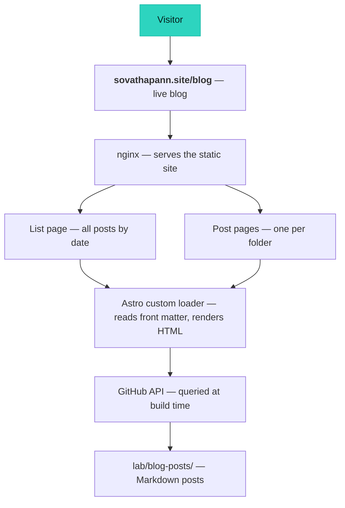
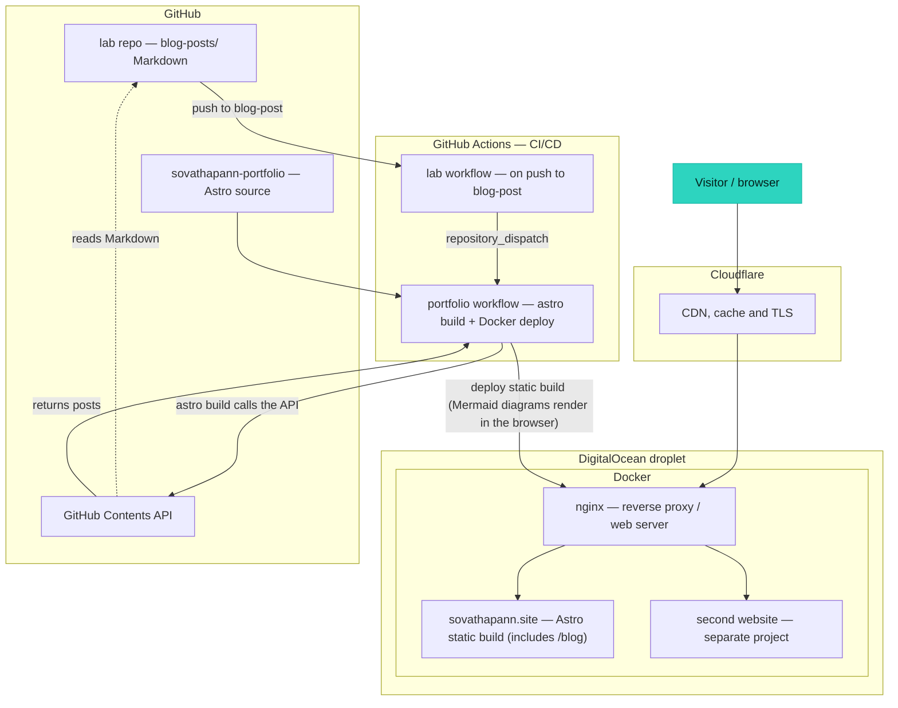

# My First Integration Blog post between github and my personal website

Well! This is my first blog where I will note all the trial and error I run into as a Master student. Honestly, writing or keeping notes were never habits of mine. I prefered to keep short notes with just the key concepts and keywords I needed before an exam. I hope this will change that for the better where I could improve on my writing skills and get better at explaining things to others. In the past, I was good at absorbing knowledge but not so good at sharing it.

In this blog post, I will share how I set up my blog so that my writing and my website live in two separate places but still come together as one. The idea is simple. I keep my posts as plain Markdown files in one GitHub repository (`https://github.com/vathapann/lab/tree/main/blog-posts`), and my personal website is a completely separate project. This way, writing a post feels like writing a note. I don't have to touch the website code at all.

## How a post becomes a page

Here is how the two sides connect. My website is built with [Astro](https://astro.build), and I wrote a small custom loader for it. When the site is built, that loader reaches out to the GitHub API, looks inside my `blog-posts` folder, and pulls in every post it finds there. Each folder becomes one blog post, and the folder name turns into the URL of that post. The loader then reads the front matter at the top of each file (the title, date, tags, and a short excerpt) and renders the Markdown body into HTML.

*The diagram below traces a request back to its source: from a visitor on the live blog, down through nginx and Astro, to the Markdown posts in the `lab` repo.*

From there, Astro generates two kinds of pages: a list page that shows all my posts sorted by date, and one page for each individual post. One thing that tripped me up at first is *when* this happens. The loader does not run every time someone visits the site. It runs once, at build time. Astro pulls in my Markdown, turns each post into a plain HTML file, and that finished set of files is what gets served. nginx on my server simply hands those static files to visitors. It never talks to GitHub, so a page reload does not fetch anything new.

That detail matters, because it means a new post does not appear on its own. If I push to the `lab` repo and nothing rebuilds the site, visitors keep seeing the old build. So I added a small piece of automation to close that gap: whenever I push a change under `blog-posts/`, a GitHub Actions workflow in the `lab` repo sends a signal to my website repo, which kicks off a fresh build and redeploy. The build re-runs the loader, pulls my latest Markdown, and ships the new static files to the server. The result is what I wanted all along: I write Markdown, push it, and a minute later the post is live at [sovathapann.site/blog](https://sovathapann.site/blog). The part I like most is the clean separation. I just write plain Markdown in one repo, and the rest happens on its own.

## The bigger picture: where everything runs

The blog is only one small part of a larger setup. Everything runs on a single [DigitalOcean](https://www.digitalocean.com) droplet, sits behind Cloudflare, and is built and deployed automatically through GitHub Actions. On that droplet, nginx runs inside Docker and acts as the web server for **two separate websites** at once: I serve https://jky-harngmeas.store/ and https://sovathapann.site . The blog is just the `/blog` section of one of them. The diagram below shows how all the pieces fit together, both when a visitor loads a page and when I publish a new post.

And here is the result of my blog page live at sovathapann.site/blog:

